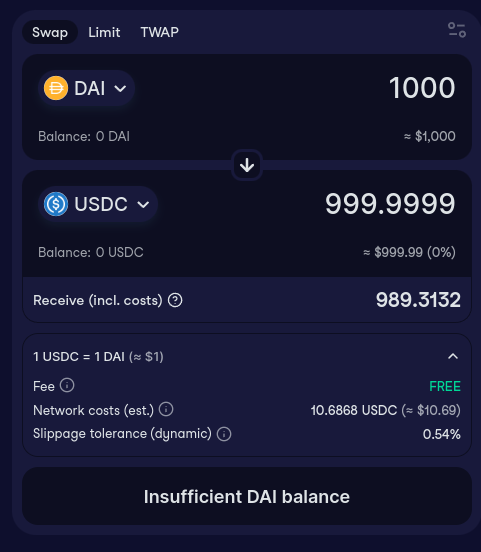

## Token Pairs & Routes

### Routes
- DAI <-> sDAI (Savings DAI)
    - 0x83F20F44975D03b1b09e64809B757c47f942BEeA
- DAI <-> USDC (DAI LitePSM-USDC @ Ethereum)
    - 0xf6e72Db5454dd049d0788e411b06CfAF16853042
- DAI <-> USDS (DAI USDS Converter @ Ethereum)
    - 0x3225737a9Bbb6473CB4a45b7244ACa2BeFdB276A
- USDS <-> USDC (USDS LitePSMWrapper-USDC @ Ethereum)
    - 0xA188EEC8F81263234dA3622A406892F3D630f98c
- USDS <-> sUSDS (sUSDS Token and Vault @ Ethereum)
    - 0xa3931d71877C0E7a3148CB7Eb4463524FEc27fbD
- MKR <-> SKY (MKR SKY Converter @ Ethereum)
    - 0xBDcFCA946b6CDd965f99a839e4435Bcdc1bc470B


## DAI <-> USDC | DAI LitePSM-USDC @ Ethereum | Integration
> Supports DAI <-> USDC conversion. <br>
> Converts DAI to USDC at a fixed ratio of 1:1 and vice versa.<br>
> `gem` is USDC. <br>
> Notice Sell function is for path USDC --> DAI. <br>
> Notice Buy function is for path DAI --> USDC. <br>

- Route [DAI LitePSM-USDC @ Ethereum](https://developers.sky.money/modules/litepsm#dai-litepsm-usdc-ethereum)
- [Codebase](https://github.com/makerdao/dss-lite-psm)
- See swap example at https://swap.cow.fi/#/1/swap/DAI/USDC



### Features
- Enables users to trade DAI with other stablecoins like USDC (referred to as "gems") at **fixed exchange ratios and fees**.
- A lightweight PSM implementation.
- Swaps Dai for `gem` at a 1:1 exchange rate.
- Fees `tin` and `tout` might apply.
- `gem` balance is kept in `pocket` instead of this contract.
- A few assumptions are made:
     1. There are no other urns for the same `ilk`
     2. Stability fee is always zero for the `ilk`
     3. The `spot` price for gem is always 1 (`10**27`).
     4. The `spotter.par` (Dai parity) is always 1 (`10**27`).
     5. This contract can freely transfer `gem` on behalf of `pocket`.


### Sell
> Notice swapping 1000 DAI to USDC will result in 999.9999 USDC due to rounding.<br>
> Fees for selling `gem` uint256 public tin` <br>
> Reverts if `tin` is set to `HALTED` <br>
> Special value for `tin` and/or `tout` to indicate swaps are halted.<br>
> Setting `tin` or `tout` to `type(uint256).max` will cause sell gem and buy gem functions respectively to revert. <br>

```solidity
    /**
     * @notice Function that swaps `gem` into Dai.
     * @dev Reverts if `tin` is set to `HALTED`.
     * @param usr The destination of the bought Dai.
     * @param gemAmt The amount of gem to sell. [`gem` precision].
     * @return daiOutWad The amount of Dai bought.
     */
    function sellGem(address usr, uint256 gemAmt) external returns (uint256 daiOutWad) {
        uint256 tin_ = tin;
        require(tin_ != HALTED, "DssLitePsm/sell-gem-halted");
        daiOutWad = _sellGem(usr, gemAmt, tin_);
    }

    /**
     * @notice Internal function that implements the logic to swaps `gem` into Dai.
     * @param usr The destination of the bought Dai.
     * @param gemAmt The amount of gem to sell. [`gem` precision].
     * @param tin_ The fee rate applicable to the swap [`1 * WAD` = 100%].
     * @return daiOutWad The amount of Dai bought.
     */

    function _sellGem(address usr, uint256 gemAmt, uint256 tin_) internal returns (uint256 daiOutWad) {
        daiOutWad = gemAmt * to18ConversionFactor;
        uint256 fee;
        if (tin_ > 0) {
            fee = daiOutWad * tin_ / WAD;
            // At this point, `tin_ <= 1 WAD`, so an underflow is not possible.
            unchecked {
                daiOutWad -= fee;
            }
        }

        gem.transferFrom(msg.sender, pocket, gemAmt);
        // This can consume the whole balance including system fees not withdrawn.
        dai.transfer(usr, daiOutWad);

        emit SellGem(usr, gemAmt, fee);
    }

```

### Buy

```solidity
    /**
     * @notice Function that swaps Dai into `gem`.
     * @dev Reverts if `tout` is set to `HALTED`.
     * @param usr The destination of the bought gems.
     * @param gemAmt The amount of gem to buy. [`gem` precision].
     * @return daiInWad The amount of Dai required to sell.
     */
    function buyGem(address usr, uint256 gemAmt) external returns (uint256 daiInWad) {
        uint256 tout_ = tout;
        require(tout_ != HALTED, "DssLitePsm/buy-gem-halted");
        daiInWad = _buyGem(usr, gemAmt, tout_);
    }

    /**
     * @notice Internal function implementing the logic that swaps Dai into `gem`.
     * @param usr The destination of the bought gems.
     * @param gemAmt The amount of gem to buy. [`gem` precision].
     * @param tout_ The fee rate applicable to the swap [`1 * WAD` = 100%].
     * @return daiInWad The amount of Dai required to sell.
     */
    function _buyGem(address usr, uint256 gemAmt, uint256 tout_) internal returns (uint256 daiInWad) {
        daiInWad = gemAmt * to18ConversionFactor;
        uint256 fee;
        if (tout_ > 0) {
            fee = daiInWad * tout_ / WAD;
            daiInWad += fee;
        }

        dai.transferFrom(msg.sender, address(this), daiInWad);
        gem.transferFrom(pocket, usr, gemAmt);

        emit BuyGem(usr, gemAmt, fee);
    }

```

## USDS <-> USDC | USDS LitePSMWrapper-USDC @ Ethereum | Integration
> <b>DETAILS</b><br>
> Supports USDS <-> USDC conversion. <br>
> Converts USDS to USDC at a fixed ratio of 1:1 and vice versa.<br>
> `gem` is USDC. <br>
> Notice Sell function is for path USDC --> USDS. <br>
> Notice Buy function is for path USDS --> USDC. <br>

- Route: [USDS LitePSMWrapper-USDC @ Ethereum](https://developers.sky.money/modules/litepsm#usds-litepsmwrapper-usdc-ethereum)
- [Codebase](https://github.com/makerdao/usds-wrappers/blob/dev/src/UsdsPsmWrapper.sol)
- USDS LitePSMWrapper-USDC: 0xA188EEC8F81263234dA3622A406892F3D630f98c

### Sell

```solidity
    function sellGem(address usr, uint256 gemAmt) external returns (uint256 usdsOutWad) {
        gem.transferFrom(msg.sender, address(this), gemAmt);
        usdsOutWad = psm.sellGem(address(this), gemAmt);
        legacyDaiJoin.join(address(this), usdsOutWad);
        usdsJoin.exit(usr, usdsOutWad);
    }
```

### Buy

```solidity
    function buyGem(address usr, uint256 gemAmt) external returns (uint256 usdsInWad) {
        uint256 gemAmt18 = gemAmt * to18ConversionFactor;
        usdsInWad = gemAmt18 + gemAmt18 * psm.tout() / WAD;
        usds.transferFrom(msg.sender, address(this), usdsInWad);
        usdsJoin.join(address(this), usdsInWad);
        legacyDaiJoin.exit(address(this), usdsInWad);
        psm.buyGem(usr, gemAmt);
    }
```

## DAI <-> USDS | DAI USDS Converter @ Ethereum | Integration
> <b>DETAILS</b><br>
> Supports DAI <-> USDS conversion. <br>
> Converts DAI to USDS at a fixed ratio of 1:1 and vice versa.<br>
> No Fees assessed. Fees cannot be enabled on this route in the future.<br>

- Route [DAI-USDS Converter @ Ethereum](https://developers.sky.money/modules/usds#dai-usds-converter-ethereum)
- [Codebase](https://github.com/makerdao/usds/blob/dev/src/DaiUsds.sol)
- DAI-USDS Converter: 0x3225737a9Bbb6473CB4a45b7244ACa2BeFdB276A

### Sell DAI --> USDS

```solidity
    function daiToUsds(address usr, uint256 wad) external {
        dai.transferFrom(msg.sender, address(this), wad);
        daiJoin.join(address(this), wad);
        usdsJoin.exit(usr, wad);
        emit DaiToUsds(msg.sender, usr, wad);
    }
```

### Sell USDS --> DAI

```solidity
    function usdsToDai(address usr, uint256 wad) external {
        usds.transferFrom(msg.sender, address(this), wad);
        usdsJoin.join(address(this), wad);
        daiJoin.exit(usr, wad);
        emit UsdsToDai(msg.sender, usr, wad);
    }

```

## USDS <-> sUSDS | USDS sUSDS Converter @ Ethereum | Integration
> Details<br>
> Contract contains an ERC20 compatible interface to allow users to view and transfer their sUSDS balances, along with Permit functionality for gas-less transfers.<br>
> Contract contains an ERC4626 compatible interface to allow users to deposit USDS to receive sUSDS or withdraw USDS with their sUSDS balance. <br>
> No fees assessed. Fees cannot be enabled on this route in the future.<br>

- Route [sUSDS Token and Vault @ Ethereum](https://developers.sky.money/modules/susds-savings-usds#susds-token-and-vault-ethereum)
- [Codebase](https://github.com/makerdao/sdai/tree/susds)
- sUSDS Token & Vault: 0xa3931d71877C0E7a3148CB7Eb4463524FEc27fbD
- sUSDS Implementation: 0x4e7991e5C547ce825BdEb665EE14a3274f9F61e0

It uses a standard ERC-4626 vault: 
- `asset` is USDS
- `share` is sUSDS

- deposit() -> deposit a `specifiedAmount` of `asset` USDS and mint `shares` of sUSDS
- mint() -> mint a `specifiedAmount` of `shares` of sUSDS and receive `assets` of USDS
- withdraw() -> withdraw a `specifiedAmount` of `asset` of USDS and burn `shares` of sUSDS
- redeem() -> redeem (burn)a `specifiedAmount` of `shares` of sUSDS and receive `assets` of USDS


### MKR <-> SKY
> <b>DETAILS</b><br>
> The conversion rate between MKR and SKY is fixed at 1:24,000.<br>
> SKY token is an ERC-20 token with permit functionality and EIP-1271 signature validation.<br>
> MKR SKY Converter enables two-way conversions between MKR and SKY tokens, utilizing the mint and burn functions of both tokens.<br> 
> The exchange rate is fixed at 1:24000. However, if minting capabilities are removed from either token, conversion for that token will no longer be possible.<br>
> Additionally, converting MKR to SKY may result in small amounts being lost if the amount is not a multiple of the conversion rate.<br>

- Route [MKR-SKY Converter @ Ethereum](https://developers.sky.money/modules/sky#mkr-sky-converter-ethereum)
- [Codebase](https://github.com/makerdao/sky/blob/dev/src/MkrSky.sol)
- MKR SKY Converter: 0xBDcFCA946b6CDd965f99a839e4435Bcdc1bc470B

### Sell MKR --> SKY

```solidity
    function mkrToSky(address usr, uint256 mkrAmt) external {
        mkr.burn(msg.sender, mkrAmt);
        uint256 skyAmt = mkrAmt * rate;
        sky.mint(usr, skyAmt);
        emit MkrToSky(msg.sender, usr, mkrAmt, skyAmt);
    }
```

### Sell SKY --> MKR

```solidity
    function skyToMkr(address usr, uint256 skyAmt) external {
        sky.burn(msg.sender, skyAmt);
        uint256 mkrAmt = skyAmt / rate; // Rounding down, dust will be lost if it is not multiple of rate
        mkr.mint(usr, mkrAmt);
        emit SkyToMkr(msg.sender, usr, skyAmt, mkrAmt);
    }

```